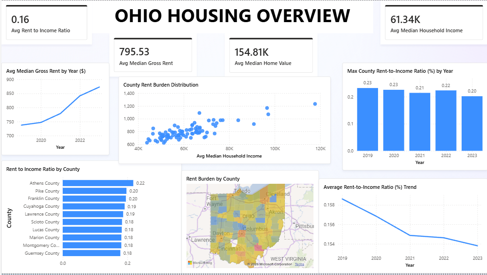
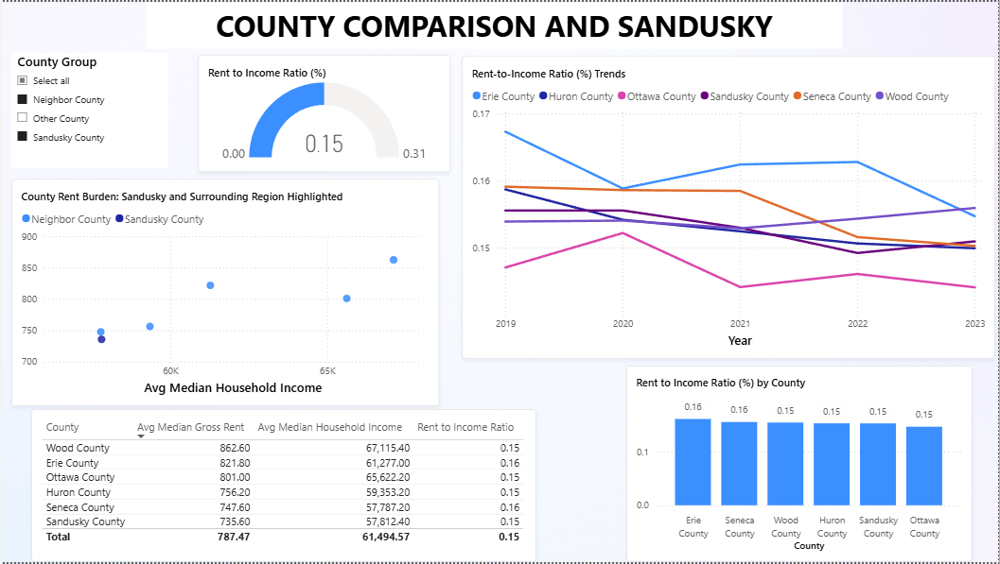
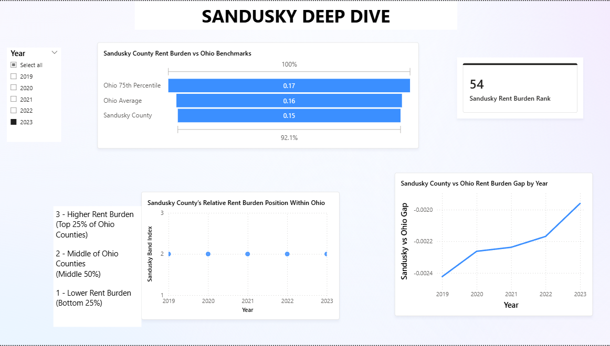

# Ohio-Housing-Affordability-2019-2023-PowerBI-Project
Power BI analysis of housing affordability across Ohio counties (2019–2023), using U.S. Census ACS data to examine income, rent, home values, and rent-to-income ratios at the county level.

## Project Overview

This project analyzes housing affordability across Ohio counties from 2019 to 2023 using publicly available U.S. Census American Community Survey (ACS) data. The analysis focuses on key affordability indicators, including median household income, median gross rent, median home value, and rent-to-income ratios at the county level.

The goal of the project is to identify spatial and temporal patterns in housing affordability, highlight counties experiencing elevated housing cost pressure, and explore how affordability has evolved over time. Interactive Power BI dashboards are used to support exploratory analysis and comparative insights across counties and years.

This project was developed as a portfolio demonstration of data modeling, DAX measure design, and analytical storytelling using Power BI, with the project focus motivated by volunteer experience related to housing affordability in Sandusky County.

---

## Data Sources

County-level housing affordability data was retrieved from the U.S. Census Bureau’s American Community Survey (ACS) 5-Year Estimates using the Census API. The analysis draws from ACS Data Profile tables for Ohio counties covering the years 2019–2023.

- **U.S. Census Bureau – American Community Survey (ACS) 5-Year Estimates**
  - County-level data on median household income, median gross rent, and median home value
  - Years: 2019–2023
  - Census API (ACS 5-Year): https://www.census.gov/data/developers/data-sets/acs-5year.html

The analysis uses median household income (DP03), median gross rent (DP04), and median home value (DP04) variables retrieved programmatically via the ACS 5-Year Data Profile endpoints.
All data used in this project is publicly available.

---

## Data Preparation & Modeling

- Data was retrieved via the U.S. Census API and cleaned using Power Query.
- Separate yearly datasets (2019–2023) were standardized and appended into a single fact table.
- A county-level geographic key was constructed to support consistent joins and mapping.
- A dedicated Year dimension table was created to enable proper time-based analysis.
- The final model follows a star-schema style structure optimized for analytical queries.

---

## Key Metrics & Measures

Core analytical measures were implemented using DAX, including:

- Average Median Household Income
- Average Median Gross Rent
- Average Median Home Value
- Rent-to-Income Ratio

In addition, supporting DAX measures were developed to enable county-level ranking, percentile-based comparisons, and focused analysis of selected counties relative to statewide benchmarks.
Supporting measures include percentile thresholds, rank calculations, and county-to-state comparison metrics used for visual emphasis and narrative analysis.

All measures respond dynamically to year and county filters.

---

## Dashboard Pages

### 1. Ohio Housing Overview
Summarizes statewide housing affordability conditions across Ohio counties using aggregate indicators, selected time trends, and cross-county comparisons, providing context for more detailed county-level analysis.

- 

---

### 2. County Comparison & Sandusky Context
Enables county-level comparison with a focused view of Sandusky County relative to neighboring counties, emphasizing differences in rent-to-income ratio dynamics.

- 

---

### 3. Sandusky Deep Dive
Examines Sandusky County’s housing affordability in detail, benchmarking its rent burden against statewide averages and percentile thresholds and tracking changes in its relative standing over time.

- 

---

## Project File Contents

- [Ohio Housing Affordability](Ohio_Housing_Affordability.pbix) — Complete Power BI report including the data model, DAX measures, and interactive visuals  
- [Dashboard - Ohio Housing Overview](Page_1.png) — Static preview of the Ohio Housing Overview dashboard
- [Dashboard - County Comparison and Sandusky](Page_2.png) — Static preview of the County Comparison and Sandusky dashboard
- [Dashboard - Sandusky Deep Dive](Page_3.png) — Static preview of the Sandusky Deep Dive dashboard
- [Insights](Insights.pdf) — Analytical insights report detailing statewide trends, county-level comparisons, and a focused assessment of Sandusky County.

---

## Notes & Limitations

- The analysis focuses on county-level aggregates and does not capture within-county variation.
- Affordability metrics are descriptive and do not imply causality.
- Additional labor market or nonprofit activity data may be incorporated in future extensions.

---

## Tools Used

- Power BI (data modeling, DAX, visualization)
- Power Query (data ingestion and transformation)
- U.S. Census ACS API

---

